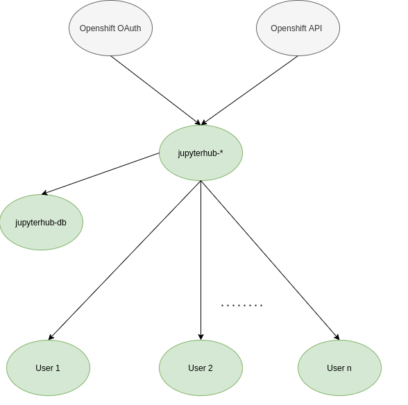
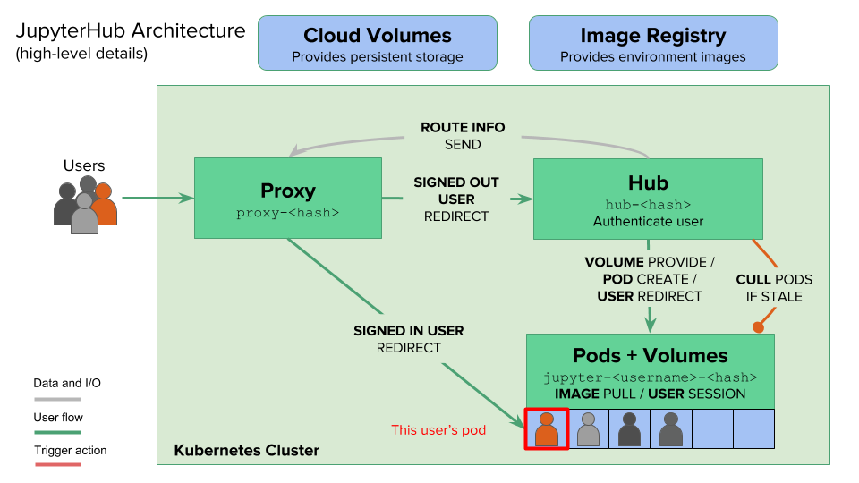

# Jupyterhub pod dependency graph

Jupyterhub application deployed on the operate first cluster works with interaction of several pods. This document defines the dependency graph. Each node in the graph represents a pod for which metrics, logs, and events can be observed. For the initial iteration, we are excluding the spark pods.

- The ovals represent a pod.

- Green color means that we can observe logs, metrics, and events data for these pods, no color indicates it may be difficult to obtain those.

- The arrows represent the causal flow (It may need a closer look).

## Explanation

1. The most important pod is the jupyterhub-* pod. The suffix here is usually the deployment number (so in the current case it's 124) followed by some identifier. This pod has an active service account and is responsible for authentication and spawning user pods. When a user tries to start a server, first this pod communicates with the Openshift Oauth pod(s) to validate if the user has the right credentials. If that is the case, it then communicates with Openshift API to allocate the desired resources (RAM, CPU, PVC, GPU) to the user and create a pod for them. The arrows go from Openshift API to jupyterhub-* since a problem with the former can give errors to the latter and not the other way round.

2. jupyterhub-db pod is a postgresql database pod that stores user information like user details, session details etc.

3. The User 1 - User n pods are specific to each user. Each pod has the necessary environment to run it's user's notebooks. We can look at logs to see the state of notebook kernels and look at metrics to see resource usage.

# Jupyterhub architecture

For a better understanding of actual working of the application, refer to the following graph and resources.

Jupyterhub resources ([database](https://jupyterhub.readthedocs.io/en/stable/reference/database.html), [build_image](https://github.com/opendatahub-io/jupyterhub-quickstart))
